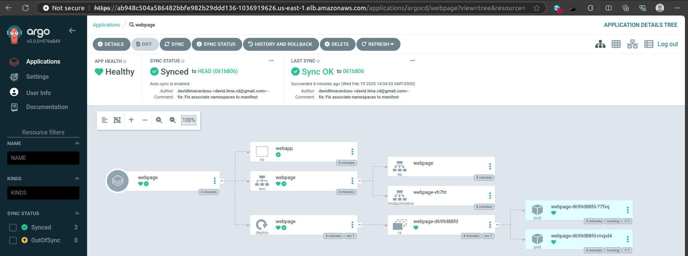
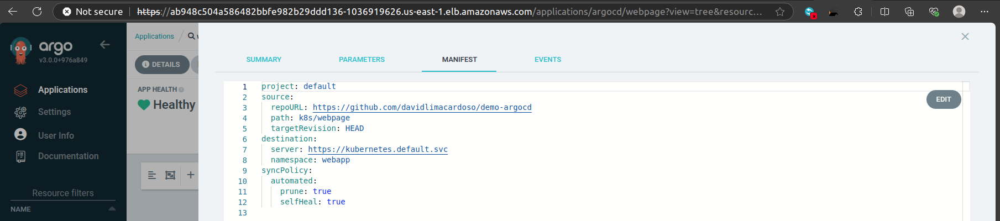

# ArgoCD Demo Project

This project demonstrates the implementation of GitOps principles using ArgoCD for Kubernetes deployments. It showcases how to manage and automate application deployments in a Kubernetes cluster using ArgoCD.

## Project Structure
```
├── img # Images directory for documentation
│ ├── example1.png
│ └── manifest.png
├── k8s # Kubernetes manifests directory
│ ├── argocd # ArgoCD specific configurations
│ │ ├── applications # ArgoCD application definitions
│ │ │ └── webapp.yml # Web application configuration
│ │ └── cluster # Cluster-level configurations
│ │ └── deployment.yml
│ └── webpage # Web application manifests
│ └── deployment.yml
```

## Features
- Automated deployment using GitOps methodology
- Kubernetes manifest management
- ArgoCD application configuration
- Web application deployment example

## Prerequisites
- Kubernetes cluster
- ArgoCD installed on the cluster
- kubectl CLI tool
- Git

## Installation

1. Install ArgoCD in your cluster:
```bash
kubectl create namespace argocd
kubectl apply -n argocd -f https://raw.githubusercontent.com/argoproj/argo-cd/stable/manifests/install.yaml
```
Or:
## Argo Install

```bash
kubectl apply -f k8s/argocd/deployment.yml -n argocd
```

2. Get Argo Secret
```bash
kubectl get secret argocd-initial-admin-secret -n argocd -o jsonpath="{.data.password}" | base64 -d
```

3. Apply the ArgoCD application configuration:

``` bash
kubectl apply -f k8s/argocd/applications/webapp.yml
```

4. Deploy the cluster configurations:

``` bash
kubectl apply -f k8s/argocd/cluster/deployment.yml
```

## Usage
Access the ArgoCD UI:
1. Access the ArgoCD UI:

## Results




``` bash
kubectl port-forward svc/argocd-server -n argocd 8080:443
```
2. Monitor your application deployment through the ArgoCD dashboard

3. The web application can be accessed according to the configuration in k8s/webpage/deployment.yml


## Configuration
### ArgoCD Application Configuration
The application configuration is defined in k8s/argocd/applications/webapp.yml. This defines how ArgoCD should deploy and sync your application.

### Web Application Configuration
The web application deployment configuration is located in k8s/webpage/deployment.yml.

### Directory Details

k8s/: Contains all Kubernetes-related configurations

argocd/: ArgoCD-specific configurations

webpage/: Web application deployment manifests

## Best Practices
Always version control your Kubernetes manifests

Use declarative configurations

Follow GitOps principles for deployment management

Regularly sync your ArgoCD applications with Git repository

## Contributing
Fork the repository

Create your feature branch ( git checkout -b feature/AmazingFeature)

Commit your changes ( git commit -m 'Add some AmazingFeature')

Push to the branch ( git push origin feature/AmazingFeature)

Open a Pull Request
